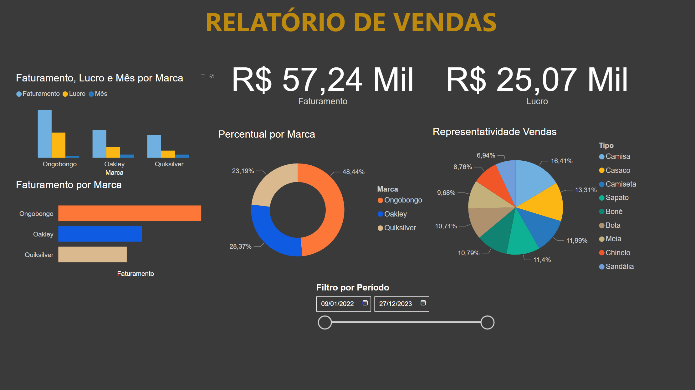

# 💵 Dashboard de Vendas Simples
Criado para treinar a ferramenta de BI, com a limpeza e transformação dos dados com o power query, criação de relacionamentos e modelagem de dados, e cálculos para análise dos mesmos com o DAX. 

Relatório de vendas simples, planilha limpa e relacionamentos sincronizados.

## 📊 Gráficos
- Faturamento, Lucro e Mês por Marca;
- Faturamento por Marca;
- Faturamento Total;
- Lucro Total;
- Percentual por Marca;
- Representatividade de Vendas.

Além de poder filtrar por períodos, feito de forma limpa e objetiva, testando os funcionamentos da ferramenta.

***

[__➡️ Clique aqui para visualizar na prática ⬅️__](https://app.powerbi.com/view?r=eyJrIjoiZTg5MTBkNmEtOTA5Mi00NjY5LTkzMjQtZjFjYjI4MjljNjdmIiwidCI6IjAwZDE0NDU5LTRiOTMtNDI5Ny04ZjViLTVhYmUyMDQwNGUxOSJ9)

***
Exemplo:

